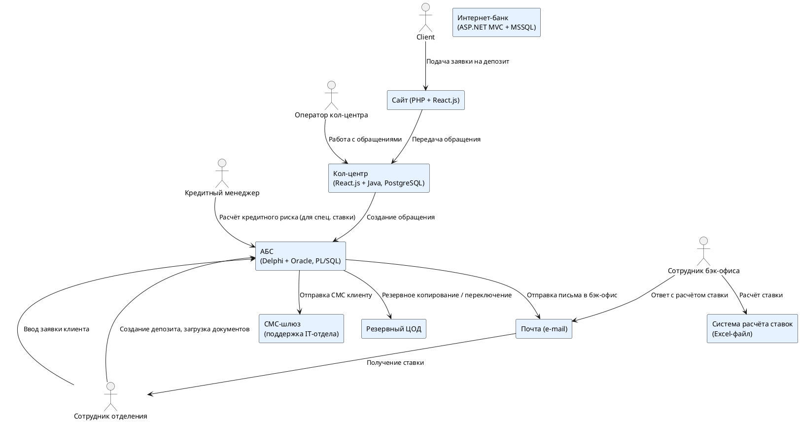

# Карта текущего IT-ландшафта банка «Стандарт»

| Подразделение / Система                          | Продажи в сети отделений                  | Продажи через кол-центр                     | Digital-оповещения клиентов           | Обслуживание депозитных процессов      | Обслуживание кредитных процессов      | Управление договорами                 |
|--------------------------------------------------|-------------------------------------------|---------------------------------------------|----------------------------------------|----------------------------------------|----------------------------------------|----------------------------------------|
| **Управление отделениями**                       | АБС (десктоп клиент, Delphi + Oracle)     | -                                           | -                                      | Работа с документами через АБС        | -                                      | Загрузка сканов договоров в АБС       |
| **Кол-центр**                                    | -                                         | Система кол-центра (React, Java, PostgreSQL) | -                                      | -                                      | -                                      | -                                      |
| **Партнёрский кол-центр**                        | -                                         | Внешняя система                             | -                                      | -                                      | -                                      | -                                      |
| **IT-отдел**                                     | Поддержка АБС                             | Сопровождение СМС-шлюза, взаимодействие     | СМС-шлюз                                | Поддержка Excel-файлов                | Поддержка Excel-файлов                | Администрирование Oracle              |
| **Управление депозитных продуктов**              | -                                         | -                                           | -                                      | Excel-файл расчёта ставок, e-mail      | -                                      | -                                      |
| **Управление кредитных продуктов**              | -                                         | -                                           | -                                      | -                                      | Анализ рисков в разделе АБС           | -                                      |
| **Цифровая трансформация**                       | Анализ процесса                          | Анализ использования кол-центра             | Анализ каналов                          | Проектирование цифрового продукта     | Взаимодействие с командой кредитов    | -                                      |
| **Сайт**                                         | -                                         | -                                           | -                                      | Планируется подача заявки на депозит  | Планируется подача заявки на кредит   | -                                      |
| **Интернет-банк**                                | -                                         | -                                           | -                                      | Сейчас: нет, План: MVP по заявкам     | -                                      | -                                      |
| **Подрядчик (Интернет-банк)**                    | Разработка и обновление монолита          | -                                           | -                                      | Обновление ядра                       | -                                      | -                                      |
| **Подрядчик (Система кол-центра)**               | -                                         | Поддержка и развитие CRM/кол-центра         | -                                      | -                                      | -                                      | -                                      |
| **Резервный ЦОД**                                | Хостинг интернет-банка                    | -                                           | -                                      | -                                      | -                                      | -                                      |

## Диаграмма интеграции приложений

