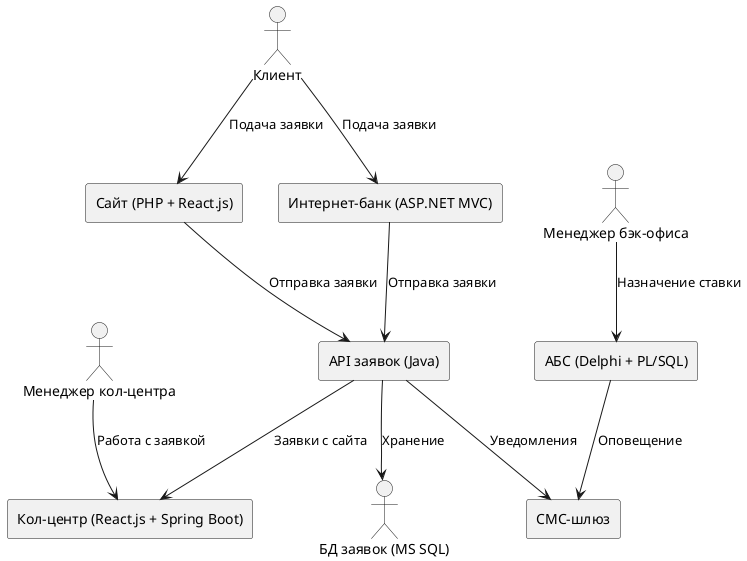
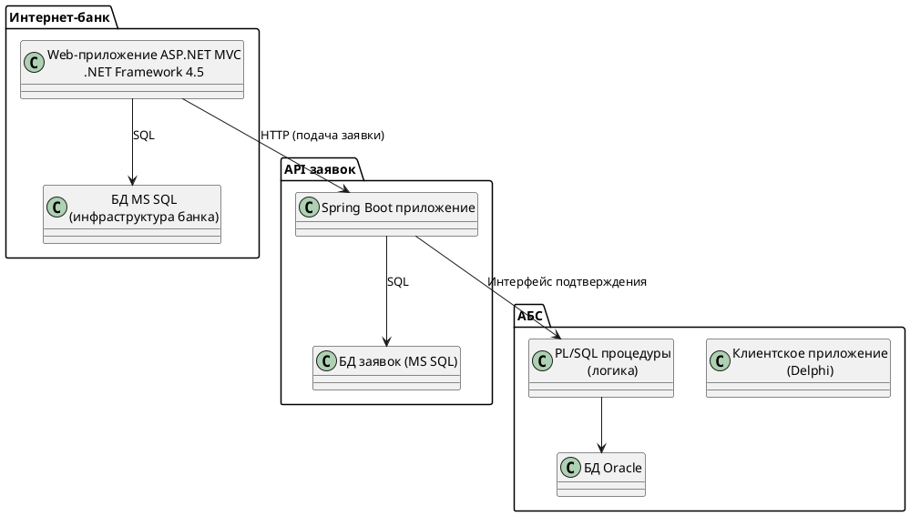

# ADR: MVP открытия депозитов онлайн

**ID:** ADR-STD-MVP-Deposit-001  
**Дата:** 03.05.2025  
**Автор:** Александр Гусев  

---

## Контекст

Цель — предоставить клиентам возможность подавать заявки на открытие депозитов через интернет-банк и сайт.  
В MVP предполагается, что окончательное оформление депозита и установка ставки осуществляется вручную сотрудниками бэк-офиса через АБС.  
Решение должно быть совместимо с текущим IT-ландшафтом и учитывать ограничения по безопасности, масштабируемости и доступности.

---

## Функциональные требования (Use Cases)

- **UC1.** Клиент видит список доступных депозитов и может подать заявку на открытие депозита на сайте или в интернет-банке.
- **UC2.** Заявка с сайта передаётся менеджеру кол-центра, который связывается с клиентом.
- **UC3.** В интернет-банке клиент получает персонализированные ставки и подтверждает заявку через СМС.
- **UC4.** Менеджер бэк-офиса подтверждает заявку и назначает ставку в АБС.
- **UC5.** После подтверждения условий клиент получает СМС-оповещение.

---

## Нефункциональные и архитектурно значимые требования

- **Доступность:** 99.9% доступности интернет-банка и систем API заявок.
- **Производительность:** Быстрый отклик на действия пользователя — в пределах миллисекунд.
- **Безопасность:** Шифрование всех пользовательских данных при передаче.
- **Надёжность:** Устойчивость к отказам — интернет-банк должен работать в 2 ЦОД.
- **Совместимость:** Использование стеков .NET, Java, PHP, MS SQL, Oracle.
- **Масштабируемость:** Горизонтальное масштабирование новых компонентов; вертикальное — для АБС.
- **Изоляция:** Заявки обрабатываются без прямого доступа к АБС.
- **Документирование:** Все новые сервисы сопровождаются документацией.

---

## Решение

### Диаграмма C4 — Уровень контекста (System Context)

### Диаграмма C4 — Уровень контейнеров

---

## Альтернативы

- Прямая интеграция интернет-банка с АБС.  
  Отклонено: высокая нагрузка и слабая масштабируемость.

- Перевод интернет-банка на микросервисы.  
  Отклонено: слишком большие изменения для этапа MVP.

---

## Ограничения и риски

- Потенциальная перегрузка АБС при росте нагрузки — решение: промежуточное API.
- Требуются отдельные команды и стейкхолдеры для интеграции между отделами.
- Проблема скорости отклика может потребовать рефакторинга справочных функций.
- Сложность синхронизации между кол-центром и внутренним API.

---
